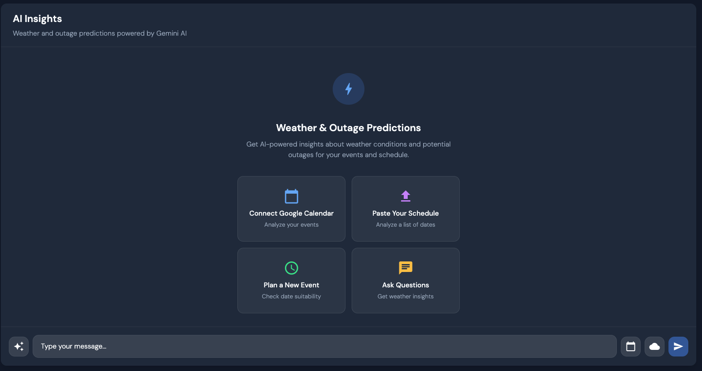

<h1 align="center">
  
  <br>
  <a>Gemicast</a> - <i>AI-Powered Outage Prediction Dashboard</i>
</h1>

<p align="center">
  <a href="https://angular.io/" target="_blank"></a>
  <a href="https://www.typescriptlang.org/" target="_blank"></a>
  <a href="https://tailwindcss.com/" target="_blank"></a>
  <a href="https://tensorflow.org/" target="_blank"></a>
  <a href="https://ai.google.dev/" target="_blank"></a>
  <a href="https://cloud.google.com/" target="_blank"></a>
</p>

<h1 align="center">
  
  <br>
</h1>

Gemicast is an intelligent power outage prediction platform developed by students from Vanderbilt University. This project was created for the Google Developer Group Solutions Challenge, aiming to design a predictive system that accurately forecasts localized power outages using real-time weather, environmental, and historical data.

## Motivation

This project was motivated by real-world challenges as Vanderbilt Students living in Nashville, TN. During the week of March 30 - April 5, 2025, Nashville experienced severe weather conditions including tornado warnings, flash flooding, and severe thunderstorms, [leaving at least 5 dead and significant power disruptions across the region](https://www.tennessean.com/story/news/local/2025/04/03/tennessee-severe-weather-latest-nashville-updates-flooding-tornado/82789952007/). These events highlighted the critical need for proactive outage prediction systems to enhance community resilience.

## Features

The application provides a comprehensive dashboard with multiple components:

### Home

- Main statistical overview
- Current location tracking (utilizing Google Geolocator/Maps API)
- Outage Risk Score (from prediction model)
- Interactive graphs showing outage risk over time
- Weather risk assessment

### Map

- Detailed visualization of outage areas
- Community-driven reporting system (similar to Waze)
- Interactive map interface
- Real-time outage monitoring

### Outages

- County-specific outage risk assessment
- Historical outage data visualization
- Risk factor analysis
- Weather condition integration
- Actionable recommendations based on risk levels

### Predict

- AI-powered insights (using Gemini API)
- Google Calendar integration for event planning
- Schedule analysis for outage risk
- Event planning assistance
- Weather and outage-related Q&A

## Tech Stack

- **Frontend**: Angular 19
- **Models**: TensorFlow Decision Forests for outage prediction
- **AI Integration**: Google Gemini API
- **APIs we considered**:
  - NOAA Weather API
  - Google Maps API
  - Google Calendar API
- **Data Sources for TensorFlow Model**:
  - [NOAA Weather Data](https://weather-gov.github.io/api/general-faqs)
  - [Oak Ridge Eagle-I Power Outage Data (2014-2022)](https://doi.ccs.ornl.gov/dataset/ccec86f0-e144-5de8-aee0-fb26028b26e1)
  - [Event-correlated Eagle-I power outages (2014-2023)](https://data.openei.org/submissions/6458)

## Getting Started

### Prerequisites

- Node.js v18.19.1
- Angular CLI v19.2.5
- Google Cloud account for API access

### Installation

1. Clone the repository:

```bash
git clone https://github.com/yourusername/gemicast.git
cd gemicast
```

2. Install dependencies:

```bash
npm install
```

3. Set up environment variables:
   Create a `.env` file based on the `.env.example` file.

4. Start the development server:

```bash
ng serve
```

5. Open your browser and navigate to `http://localhost:4200/`

6. To run tests, enter the command:

```bash
ng test
```

### Using nvm (Node Version Manager)

If you encounter compatibility issues, ensure you're using the correct Node.js version:

```bash
# Check Angular CLI compatibility with your Node version
ng version

# Install and use the recommended Node version
nvm install v18.19.1
nvm use v18.19.1
```

## Cloud Resources

Athough we didn't use any cloud resources for this iteration, the solution will be using the following Google Cloud resources:

- Vertex AI platform
- Compute Engine VMs
- BigQuery
- Cloud Run
- Firebase and Firestore for notifications

## Project Status

This project is currently in development. The frontend components are implemented with placeholder functionality, and we've included the TensorFlow Decision Forest model under `src/app/prediction` for viewing and access. The data on the outages portion is a mixture of outputs from the model and placholder data.

## Future Work

- Implement real-time data pipelines with an API connection to the model
- Enhance model accuracy with additional features
- Deploy the application to Google Cloud
- Add mobile notifications for outage warnings
- Expand coverage to more counties and states

## License

This project is licensed under the MIT License - see the [LICENSE](LICENSE) file for details.
