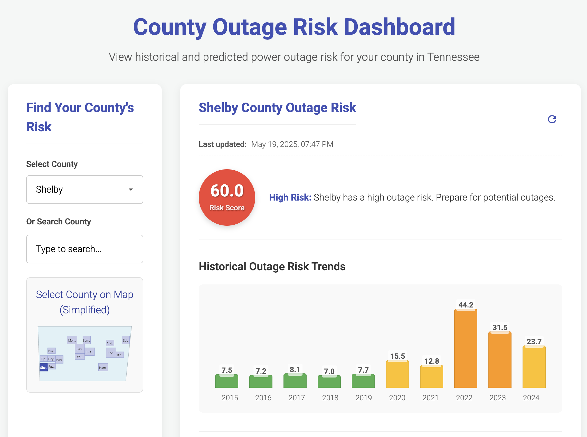

<h1 align="center">
  
  <br>
  <a>Gemicast</a> - <i>AI-Powered Outage Prediction Dashboard</i>
</h1>

<p align="center">
  <a href="https://angular.io/" target="_blank"></a>
  <a href="https://www.typescriptlang.org/" target="_blank"></a>
  <a href="https://tailwindcss.com/" target="_blank"></a>
  <a href="https://tensorflow.org/" target="_blank"></a>
  <a href="https://ai.google.dev/" target="_blank"></a>
  <a href="https://cloud.google.com/bigquery" target="_blank"></a>
  <a href="https://firebase.google.com/" target="_blank"></a>
</p>

<div align="center" style="display: flex; justify-content: center; gap: 20px; flex-wrap: wrap; margin-top: 20px;">
  
  
</div>

Gemicast is an intelligent power outage prediction platform developed by students from Vanderbilt University. This project was created for the Google Developer Group Solutions Challenge, aiming to design a predictive system that accurately forecasts localized power outages using real-time weather, environmental, and historical data.

## Motivation

This project was motivated by real-world challenges as Vanderbilt Students living in Nashville, TN. During the week of March 30 - April 5, 2025, Nashville experienced severe weather conditions including tornado warnings, flash flooding, and severe thunderstorms, [leaving at least 5 dead and significant power disruptions across the region](https://www.tennessean.com/story/news/local/2025/04/03/tennessee-severe-weather-latest-nashville-updates-flooding-tornado/82789952007/). These events highlighted the critical need for proactive outage prediction systems to enhance community resilience.

## Features

The application provides a comprehensive dashboard with multiple components:

### Dashboard

The main interface includes a responsive sidebar for navigation between the various tabs:
- Map: Visualize geographic weather and outage data
- Outages: County-specific risk assessment and historical data
- Predict: AI-powered insights and predictions
- Profile: User profile and organization management

### Outages Tab

- County-specific outage risk assessment
- Historical outage data visualization with trend charts
- Risk factor analysis with color-coded indicators
- Current weather condition integration
- Actionable recommendations based on risk levels
- Tennessee coverage statistics

### Predict Tab

- Gemini AI integration for natural language interactions
- Weather and outage prediction data visualization
- Google Calendar integration for event planning
- Schedule analysis for outage risk
- Event planning assistant with outage risk assessment
- Weather and outage-related Q&A capabilities

### Map View

- Map integration with Google Maps API
- Visualization of outage probabilities by location
- Real-time weather data display
- Interactive location selection

### Profile Management

- User profiles with notification preferences
- Organization creation and management
- Member invitations with shareable join codes
- Alert notifications for organization members
- Firebase integration for data storage

## Tech Stack

- **Frontend**: Angular 19 with Angular Material
- **Styling**: Tailwind CSS and custom components
- **Models**: TensorFlow Decision Forests for outage prediction
- **AI Integration**: Google Gemini API
- **Backend Services**:
  - Firebase Authentication and Firestore
  - Python Flask API for predictions
  - BigQuery for model serving
- **APIs**:
  - NOAA Weather API
  - Google Maps API
  - Google Calendar API
- **Data Sources for Model**:
  - [NOAA Weather Data](https://weather-gov.github.io/api/general-faqs)
  - [Oak Ridge Eagle-I Power Outage Data (2014-2022)](https://doi.ccs.ornl.gov/dataset/ccec86f0-e144-5de8-aee0-fb26028b26e1)
  - [Event-correlated Eagle-I power outages (2014-2023)](https://data.openei.org/submissions/6458)

## Getting Started

### Prerequisites

- Node.js v18.19.1
- Angular CLI v19.2.5
- Google Cloud account for API access

### Installation

1. Clone the repository:

```bash
git clone https://github.com/yourusername/gemicast.git
cd gemicast
```

2. Install dependencies:

```bash
npm install
```

3. Set up environment variables:
   Update the environment files in `src/environments/` with your API keys.

4. Start the development server:

```bash
ng serve
```

5. Open your browser and navigate to `http://localhost:4200/`

6. To run tests, enter the command:

```bash
ng test
```

### Using nvm (Node Version Manager)

If you encounter compatibility issues, ensure you're using the correct Node.js version:

```bash
# Check Angular CLI compatibility with your Node version
ng version

# Install and use the recommended Node version
nvm install v18.19.1
nvm use v18.19.1
```

## API Backend

The project includes a Python Flask API (`api/app.py`) for:
- Weather data retrieval
- Outage prediction using BigQuery ML
- County risk rankings

For local development, the API can be started with:

```bash
cd api
python app.py
```

## Machine Learning Models

The TensorFlow Decision Forests model is defined in `src/app/prediction/` directory with:
- `data_loader.py`: Data preprocessing and loading pipeline
- `noaa_model_prediction.py`: Main model definition and training
- `combined_model.py`: Enhanced model with weather data integration
- `api.py`: Flask API for serving model predictions

## BigQuery ML Integration

The project leverages Google BigQuery ML for serving the outage prediction model at scale:

- **Model Training**: The TensorFlow Decision Forests model is trained locally and then exported to BigQuery ML format
- **SQL-Based Predictions**: The prediction logic is encoded as SQL queries in `api.py`
- **Feature Engineering**: Weather features are transformed in SQL before being passed to the model
- **Scalable Inference**: Leveraging BigQuery's serverless architecture for fast predictions

Sample BigQuery ML implementation:

```sql
SELECT
  predicted_outage_occurred,
  predicted_outage_occurred_probs[OFFSET(1)].prob AS probability_of_outage
FROM
  ML.PREDICT(MODEL `project-id.power_outages.outage_model_v2`,
    (
      SELECT
        CAST(windSpeed AS FLOAT64) AS weather_windSpeed,
        CAST(windGust AS FLOAT64) AS weather_windGust,
        CAST(relativeHumidity AS FLOAT64) AS weather_relativeHumidity,
        CAST(temperature AS FLOAT64) AS weather_temperature,
        -- Additional weather features
        CAST(precipitationChance AS FLOAT64) AS weather_probabilityOfPrecipitation,
        -- County one-hot encoding
        -- Time features
        CAST(month AS INT64) AS month,
        CAST(day_of_week AS INT64) AS day_of_week,
        CAST(hour AS INT64) AS hour_of_day
    )
  )
```

This approach allows the model to scale to process predictions for all counties in Tennessee simultaneously, with minimal latency and maintenance overhead.

## Cloud Infrastructure

The application is designed to leverage Google Cloud services for production deployment:

### BigQuery and BigQuery ML

- **Data Warehousing**: Historical outage and weather data is stored in BigQuery tables for analysis
- **Model Deployment**: TensorFlow Decision Forests models are exported to BigQuery ML
- **SQL-Based Inference**: Predictions are made directly in BigQuery using ML.PREDICT functions
- **Advantages**:
  - Serverless architecture with automatic scaling
  - Low-latency predictions for all Tennessee counties
  - Easy integration with other Google Cloud services
  - Cost-efficient for large-scale data processing

### Cloud Run

- Containerized deployment of both frontend and backend components
- Auto-scaling based on traffic demands
- Global load balancing for improved reliability
- CI/CD integration for continuous deployment

### Firebase

- Real-time database for user profiles and organization data
- Authentication for secure user access
- Cloud Messaging for notification delivery
- Storage for user uploads and report attachments

### Future Cloud Integration

- Vertex AI for advanced ML model management
- Cloud Scheduler for periodic prediction updates
- Pub/Sub for real-time weather alert processing

## Project Status

This project is currently in development. Key components implemented:

- Frontend UI with Angular and Tailwind CSS
- Prediction service with API integration
- TensorFlow Decision Forests model
- Firebase user and organization management
- Google Maps integration
- Weather data visualization

Some features use placeholder data where real-time APIs are not yet connected.

## Future Work

- Deploy application on Google Cloud Run
- Implement real-time data pipelines
- Enhance model accuracy with additional weather features
- Add mobile push notifications for outage warnings
- Develop a mobile app version
- Expand coverage to more counties and states
- Integrate with utility company APIs

## License

This project is licensed under the MIT License - see the [LICENSE](LICENSE) file for details.
